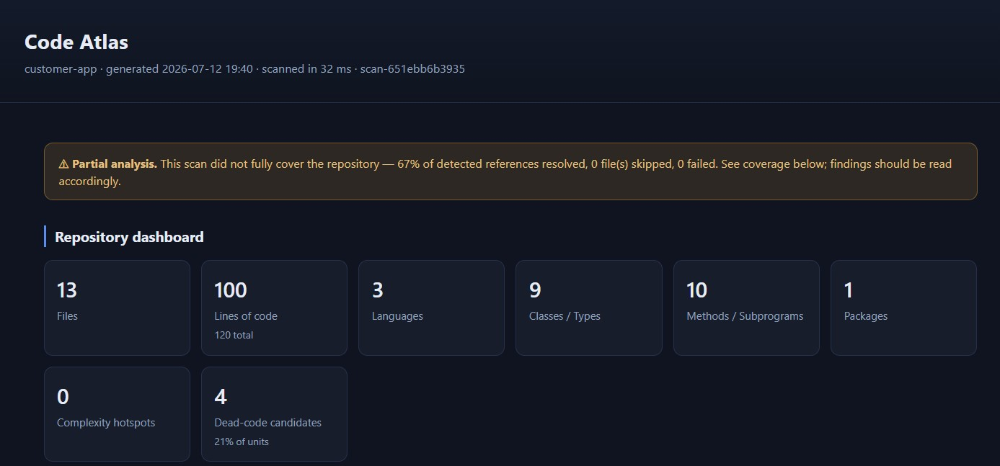

# Code Atlas - Current-State Assessment

_Assessment date: 2026-07-21. Reflects the repository as inspected, not the
original prompt. Scope: the whole codebase - the Java/Ada vertical slice plus the
analysis-coverage, stable-identifier, persistence, data-lineage, tool-API, agent,
configuration-parsing, graph-export, guided-onboarding, build-parsing and
SQL-schema work._

This document is the factual baseline: what exists, how healthy the build is, and
the concrete technical risks that later milestones must address. It is written to
be falsifiable - every claim here is checkable against the code or the test suite.

---

## Implemented (works today)

- **Repository scanner** (`atlas-scanner`): recursive walk, default directory
  exclusions (`.git`, `target`, `build`, `out`, `node_modules`, `bin`, `obj`, ...),
  extension-based language/category detection, SHA-256 content hashing, parallel
  hashing, size cap, symlink-skip by default. Verified: excluded dirs are skipped;
  identical bytes -> identical hash.
- **Java parser** (`atlas-parser-java`, JavaParser): packages, classes, interfaces,
  enums, records, methods, constructors, fields, imports, inheritance/implements,
  method calls, instantiations, **type-reference edges** (field/param/return),
  cyclomatic complexity, exposure heuristics (public/`main`/framework annotations).
- **Configuration parser** (`atlas-parser-config`): XML (Spring beans, XXE-hardened
  SAX), `.properties` and YAML -> `CONFIGURATION` entities + `CONFIGURES` code
  references (config key + location evidence); feeds dead-code (wired classes are not
  dead) and `get_configuration_references`; secrets masked, never stored.
- **Build-file parser** (`atlas-parser-build`): Maven `pom.xml` (XXE-hardened SAX),
  Gradle `build.gradle[.kts]`/`settings.gradle[.kts]` and GNAT `.gpr` -> `MODULE`
  entities with coordinates, declared dependencies (`DEPENDS_ON`, resolved to a local
  module when one matches, otherwise left unresolved as an honest third-party
  coordinate) and **declared main units** (`DECLARES_MAIN`, resolved to the subprogram
  that defines them). A cross-file linker assigns every file to the deepest module
  whose directory contains it, which makes `get_build_membership` answerable and stops
  a GNAT-declared main being reported as dead code. Read literally: nothing is
  resolved, fetched or executed.
- **SQL/DDL parser** (`atlas-parser-sql`): `CREATE TABLE`/`VIEW`, columns, primary
  keys and foreign keys (inline, table-level and `ALTER TABLE`) -> `DATABASE_OBJECT`
  and column entities with `file:line` evidence. A table's stable id is its name, so
  a declared table and the table a JPA `@Entity` maps to merge into one entity
  (`DATABASE_OBJECT` is an aggregating kind, so this is a merge, not a collision);
  a table without a `declaredIn` attribute is one no parsed schema declares. Foreign
  keys resolve to declared tables only. A statement scanner, not a SQL grammar.
- **Ada/SPARK parser** (`atlas-parser-ada`): deterministic line-and-scope scanner
  for `.ads`/`.adb` - packages & child packages, procedures, functions, types
  (record/enum/access/derived), tasks, protected types, exceptions, `with`
  dependencies, renamings, generic instantiations, **SPARK Pre/Post contracts**,
  cyclomatic complexity, spec-vs-body exposure.
- **Unified model** (`atlas-model`): language-neutral `Entity` / `Relationship` /
  `SourceLocation` with deterministic ids and adjacency indexes. Zero dependencies.
- **Cross-reference linker** (`atlas-core`): resolves symbolic call/type targets
  after all files are parsed; conservative on ambiguity (caps candidates, keeps
  originals). Now returns **link statistics** (resolved / unresolved / ambiguous).
- **Stable identifiers** (`atlas-model`): deterministic, location-independent ids
  (`java:type:...`, `ada:function:...(Integer)`, `file:...`) that survive line movement
  and rescans; exposed on findings in JSON/CSV. See [STABLE_IDENTIFIERS.md](STABLE_IDENTIFIERS.md).
- **Ada spec/body merge** (`atlas-model` + Ada parser): a package/subprogram's
  `.ads` spec and `.adb` body share one identity, retaining both source evidences
  (`hasSpec`/`hasBody`/`specLocation`/`bodyLocation`); overloads stay distinct.
- **Collision diagnostics**: two distinct declarations that share an id are recorded
  (never silently overwritten) and surfaced in the report and CLI.
- **Analysis** (`atlas-analysis`): repository metrics, complexity hotspots with
  risk bands, dead-code detection with **evidence list + confidence (capped < 100%)**
  and exposed-name propagation, package coupling + circular-dependency detection.
- **Local index** (`atlas-index`): H2 store for entities/attributes/relationships/
  file-hashes; **incremental change detection** (added/changed/removed/unchanged).
- **Reporting** (`atlas-reporting`): self-contained HTML dashboard (offline, no
  CDN/scripts), JSON, CSV. Now includes an **Analysis Coverage** section.

  
- **Graph exports** (`atlas-graph`): deterministic Graphviz **DOT** and
  self-contained **SVG** for dependency (risk-coloured coupling), call,
  dead-code (active vs probable-dead) and architecture (role-layered) graphs;
  `atlas graph --type <t> --format <dot|svg>`.
- **Guided onboarding** (`atlas-onboarding`): `atlas onboard <repo>` runs a
  twelve-stage, deterministic, read-only workflow (scan health, inventory, Java &
  Ada entry points, architecture orientation, **Java<->Ada boundary discovery**,
  representative lineage sampling, central components, risks & gaps, reading order,
  expert questions, final summary) and writes an evidence-backed package
  (deterministic JSON + self-contained HTML + text) **outside** the repository.
  It reuses the tool API and the deterministic agents; per-stage failures never
  abort the workflow. See [ONBOARDING.md](ONBOARDING.md).
- **Explorer UI** (`atlas-ui`): `atlas serve` starts a local read-only explorer on
  loopback - search the model, open an entity, and click through callers, callees,
  dependencies, members, build module, configuration references and data lineage.
  Built on the read-only tool API and the JDK's built-in HTTP server (no new
  dependency). Server-rendered HTML with a light/dark/auto theme (remembered in a
  cookie and applied server-side), live list filtering and a "/" search shortcut. The
  CSS and script are inline and nothing loads from another host, so it runs offline;
  the script is progressive enhancement, so search, navigation and the theme switcher
  all work with scripting disabled. GET-only, single-user by design (no login: the
  socket is loopback-only and the view read-only, so there is no boundary to
  authenticate across), with a nonce-based Content-Security-Policy
  (default-src 'none'), a guarded theme-return target, and every model value escaped.
- **CLI** (`atlas-cli`): `atlas scan <repo>` as a single shaded runnable jar;
  options for output dir, persistent index, thresholds, threads.

## Partially implemented

- **Evidence model.** Entities/relationships carry source locations and a
  resolved/unresolved distinction; the addendum's richer evidence (parser id +
  version, rule id, file hash, four-state resolution status) is **now introduced as
  `ResolutionStatus`** and surfaced in coverage, but is not yet attached to every
  entity/finding.
- ~~Incremental scanning.~~ **Now implemented:** persistent file-backed H2 default,
  scan versioning with failed-scan protection, and conservative reuse of unchanged
  parser results (see PERSISTENCE.md / INCREMENTAL_ANALYSIS.md). Remaining gap:
  only the latest completed scan's model snapshot is retained.
- ~~Dependency/lineage view.~~ **Now implemented** as full Java + Ada data lineage
  with per-edge evidence (see DATA_LINEAGE.md); the component-coupling view remains
  as a complementary report.

## Scaffolded only

- None. The reactor contains only modules with real, tested functionality; there
  are no empty placeholder modules or stub classes (by design - the addendum
  forbids placeholder modules).

## Missing (addendum requirements not yet implemented)

- ~~Java data lineage~~ ~~Ada data lineage~~ **Both implemented** (Java:
  endpoint->...->table; Ada: console->procedure->transformation->package state->output;
  per-edge rule ids, confidence, resolution status, gaps, CLI/JSON/HTML - see
  DATA_LINEAGE.md). Still missing: config/SQL parser input to lineage.
- Custom-format parsers, and JSON configuration. (Configuration XML/YAML/properties,
  build files (Maven/Gradle/`.gpr`) and SQL/DDL schema are implemented.)
- Ada database bindings - so a table shared between Java and Ada is still not
  detectable as a cross-language boundary. (JDBC / literal in-code SQL is extracted.)
- ~~Build membership feeding dead-code / entry-point analysis~~ **Done**: files are
  assigned to their owning module, `get_build_membership` answers, and a build-declared
  main is an entry point rather than a dead-code candidate. Build membership does not
  yet feed `calculate_change_impact`.
- ~~Read-only agent tool API~~ ~~Orientation Agent + summaries~~ ~~Data-Lineage
  Investigator Agent~~ **All done** (see AGENTS.md). A dedicated Impact agent
  remains optional future work (the `calculate_change_impact` tool op exists).
- Unused-package detection; PDF reports. (Deterministic change impact exists as
  the `calculate_change_impact` tool operation; a dedicated Impact agent is future.)

---

## Current architecture

**Module structure** (18 Maven modules, Java 21):
`atlas-model` -> `atlas-parser-api` -> `atlas-scanner` -> `atlas-parser-java` /
`atlas-parser-ada` -> `atlas-parser-config` -> `atlas-index` -> `atlas-analysis` -> `atlas-reporting` ->
`atlas-graph` -> `atlas-tools` -> `atlas-agents` -> `atlas-core` -> `atlas-cli`.

**Main execution path** (`CodeAtlasPipeline.run`):
`scan -> read+parse each file in parallel -> merge into one SoftwareModel ->
Linker resolves cross-refs -> persist to H2 -> AnalysisEngine -> assemble ReportData`.

- **Parser architecture:** `RepositoryParser` SPI discovered via `ServiceLoader`.
  Parsers are stateless; each `parse(ParseRequest)` returns an immutable
  `ParseResult` (no mutable per-instance extraction state). Cross-file targets are
  emitted as unresolved edges for the Linker.
- **Unified model:** single `SoftwareModel` (no competing second model). Entities
  keyed by deterministic string id; relationships are directed with a `resolved`
  flag and optional location.
- **Storage:** H2 via `AtlasStore`, **file-backed by default** for CLI runs (in-memory
  for tests/temporary sessions), with a database-level **read-only open mode**.
  Narrow key/value attribute table keeps it queryable. SQL is confined to
  `atlas-index` (not leaked into parsers/analysis).
- **Graph model:** adjacency indexes on `SoftwareModel` (outgoing/incoming); no
  separate graph database. Dependency/cycle analysis and the DOT/SVG graph
  exports run over these.
- **Analysis engine:** deterministic; `AnalysisEngine` composes metrics, complexity,
  dead-code, dependency analyzers. No AI anywhere.
- **CLI:** picocli; `scan`, `lineage`, `tool`, `orient`, `summarize`, `investigate`,
  `graph`, `onboard` and `serve` subcommands.
- **UI:** a local read-only explorer (`atlas serve`, `atlas-ui`) plus static HTML
  reports. Server-rendered, loopback-only, GET-only - it renders the index and can
  change nothing. Inline CSS/JS only (nothing from any host); the script is
  progressive enhancement. No interactive graph viewer yet (graphs are static SVG).
- **AI / agents:** the Repository Orientation Agent and entity summaries run in
  deterministic mode over the read-only tool API (`atlas-agents`, see AGENTS.md).
  No AI anywhere; local-AI mode remains future and optional.

## Current build health

- **Build:** `mvn clean verify` -> **BUILD SUCCESS** (18 modules).
- **Test:** `mvn clean verify` -> **220 tests, 0 failures, 0 errors, 1 intentional
  skip** across model, scanner,
  parsers (Java, Ada, configuration, build, SQL), index, analysis, core, graph,
  tools, agents, onboarding and the explorer UI.
- **Static analysis:** SpotBugs completed with 0 findings at medium confidence or
  higher. CycloneDX 1.6 generation produced a 32-component runtime SBOM.
- **Warnings:** benign SLF4J "no providers" notices during test runs (no logging
  binding on the test classpath); the CLI ships `slf4j-simple` at runtime.
- **Determinism:** verified - two scans of the same repo produce byte-identical
  JSON (excluding the timestamp field).
- **Repository immutability:** verified - file hashes are identical before and
  after a scan; analysis never writes into the analyzed repo.
- **Environment:** JDK 21, Maven 3.9+. Dependency download requires network at
  build time only; the built tool runs fully offline.

## Technical risks

1. **Unstable identifiers - RESOLVED.** Entities now use deterministic,
   location-independent stable ids; Ada spec/body declarations merge into one
   logical entity. Line movement and rescans no longer change identity (proven by
   tests). Residual: parameter types are source-spelled (no symbol solver), so two
   spellings of the same type produce different ids; and duplicate qualified names
   across files are reported as collisions rather than resolved.
2. **Incomplete symbol resolution.** Call/type resolution is name-based (no full
   classpath symbol solver), so cross-references are approximate. Handled honestly
   via the confidence model and the new coverage metric, but callers must not treat
   resolved edges as ground truth.
3. **Incomplete lineage coverage.** Java/Spring and Ada vertical slices are
   implemented with explicit sources, sinks, stores and unresolved gaps. Dynamic
   SQL, JAX-RS, message queues, and Ada database bindings remain outside the current
   rule set; see [KNOWN_LIMITATIONS.md](KNOWN_LIMITATIONS.md).
4. **Storage default - RESOLVED.** The CLI defaults to a file-backed index with
   scan records; a failed scan never replaces the last completed snapshot.
5. **Missing evidence richness.** No parser/rule versioning or file-hash provenance
   attached to findings yet.
6. **Build-context blindness - largely closed.** Maven/Gradle/GNAT files are parsed:
   every file is assigned to its owning module and a GNAT-declared main is an entry
   point (no longer a dead-code false positive). Residual risk: build files are read
   literally, so behaviour expressed through property interpolation, dependency
   management, version catalogs or scenario variables is still invisible, and
   reflection/DI-invoked code remains a false-positive source.
7. **Unsupported constructs.** Ada scanner is line-based and will miss constructs
   spanning unusual formatting; unsupported languages are detected but not parsed.
8. **Performance.** Unchanged parser results are reused, hashing and parsing use
   bounded worker pools, and graph edge de-duplication is linear. The entire model
   is still held in memory and every candidate file is hashed on each scan; revisit
   those costs for very large repositories.
9. **Security posture (good, to keep):** offline, no admin, no code execution, no
   build-script execution, repo read-only, symlinks not followed by default. No
   routable server: the optional explorer is GET-only, database-level read-only and
   bound to loopback. No certification claims are made.

---

## Recommended next steps (smallest-first)

1. **Analysis-coverage reporting + `ResolutionStatus`** (honest uncertainty). _Done._
2. **Stable identifiers + Ada spec/body merge** (resolved risk #1). _Done._
3. **Persistent file-backed H2 default + scan versioning + parse reuse** (resolved risk #4). _Done._
4. **Java data-lineage vertical slice** (endpoint->...->table, evidence-backed). _Done._
5. **Ada data-lineage vertical slice** (console->procedure->transformation->state->output). _Done._
6. **Read-only agent tool API** (atlas-tools, `atlas tool`, DB-level read-only). _Done._
7. **Deterministic summaries + Repository Orientation Agent** (atlas-agents,
   `atlas orient` / `atlas summarize`). _Done._
8. **Data-Lineage Investigator Agent** (`atlas investigate`). _Done - every
   numbered addendum milestone (1-10) is now complete._
9. Next (beyond the addendum plan): richer dynamic-language and runtime-flow
   coverage, interactive graph navigation, optional local-AI mode, AgentForge adapter.
