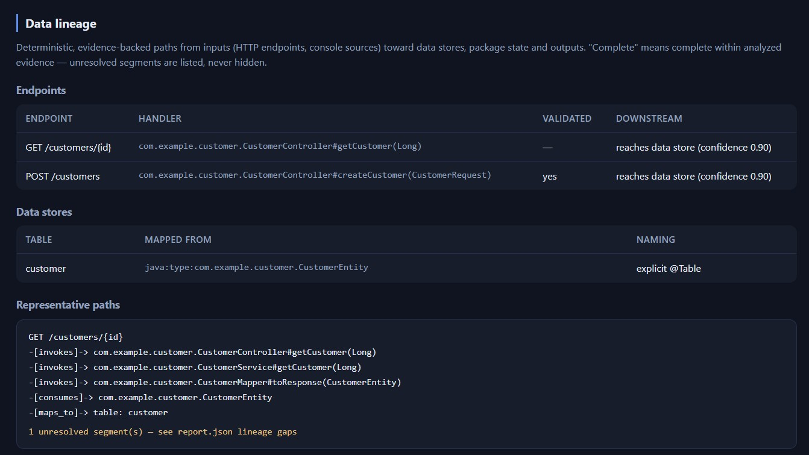

# Code Atlas — Data Lineage (Java and Ada)

Code Atlas traces where data enters an application, what transforms it, where it
is stored, and what consumes it — deterministically, offline, with evidence on
every edge, and with unresolved segments shown rather than papered over. No AI is
involved anywhere in lineage construction.

**Scope today:** two complete vertical slices —

- **Java/Spring:** `HTTP endpoint → controller → service → transformation/validation
  → Spring Data repository → JPA entity → database table → response DTO`.
- **Ada:** `console input (Ada.Text_IO) → procedure → transformation function →
  package state → reader procedure → console output`, with qualified cross-package
  state access and explicit gaps for calls into withed-but-unanalyzed units.

JAX-RS and message queues are not yet implemented (see
[Known limitations](#known-limitations)).



## Example

```
$ atlas lineage "POST /customers" --downstream

Path 1 (confidence 0.90):
  ENDPOINT  POST:/customers
    -[invokes 1.00 discovered]-> CustomerController#createCustomer(CustomerRequest)
       evidence: .../CustomerController.java:10  rule: ATLAS-LINEAGE-ENDPOINT-001
    -[invokes 0.95 resolved]->  CustomerService#createCustomer(CustomerRequest)
    -[invokes 0.95 resolved]->  CustomerMapper#toEntity(CustomerRequest)
    -[produces 0.90 resolved]-> CustomerEntity
    -[maps_to 1.00 resolved]->  table: customer

Unresolved:
  - [UNRESOLVED_TARGET] Reference to 'AnalyticsClient#push' could not be resolved
  - [EXTERNAL_CONSUMER] The consumer of 'CustomerResponse' is external and is not
    represented in this repository
```

## What is detected

| Step | Mechanism | Classification |
|---|---|---|
| HTTP endpoint | `@RestController`/`@Controller` + `@RequestMapping`/`@GetMapping`/`@PostMapping`/`@PutMapping`/`@PatchMapping`/`@DeleteMapping`, class+method path composition | DISCOVERED |
| Request/response DTOs | `@RequestBody` parameter type; return type with `ResponseEntity`/`Optional`/`List`/`Set`/`Collection`/`Iterable` wrappers unwrapped | RESOLVED |
| Controller → service → … calls | declared **field types** of the receiver (`customerService.create(…)` → field `customerService` → type `CustomerService`), arity-checked method lookup | RESOLVED |
| Dependency injection via interface | `IMPLEMENTS` graph: exactly one implementation → resolved; several → **all candidates kept, marked ambiguous** — never chosen arbitrarily | RESOLVED / INFERRED |
| Transformation | single-parameter method whose input and output are both project types **and** which instantiates its output type (type flow); naming (`to…`/`map…`/`convert…`/`from…`/`build…`) alone is only an inference | RESOLVED / INFERRED |
| Validation | `@Valid`/`@Validated` recorded as endpoint evidence; explicit `validate*(Dto)` calls become `validated_by` edges | DISCOVERED / RESOLVED |
| Repository → entity | interface extending `JpaRepository`/`CrudRepository`/… : first type argument is the managed entity | RESOLVED |
| Entity → table | `@Table(name=…)` string literal; without it, the lower-cased simple class name is used as a **documented inference** (real physical naming is configuration-dependent) | RESOLVED / INFERRED |
| Read vs write | repository method prefixes — write: `save/insert/update/delete/remove/persist/merge`; read: `find/get/read/query/count/exists/search/stream`; anything else becomes a conservative `uses` edge, never a fabricated write | RESOLVED |
| Literal SQL (JDBC / `@Query`) | tables named by a complete literal statement in a body: `SELECT`/`JOIN` → reads, `INSERT INTO`/`UPDATE`/`DELETE FROM`/`MERGE INTO` → writes (an `INSERT … SELECT` writes its target *and* reads its source). Only the derived table name and direction are stored — never the SQL text | RESOLVED |
| Runtime-assembled SQL | a literal fragment spliced into a larger expression still names a real table, but the whole statement was never visible, so the edge is lowered to 0.60 and marked inferred; SQL built entirely from variables is invisible | INFERRED |
| Unresolvable references | a call through a declared field whose type is not in the repository becomes an explicit **UNRESOLVED** edge and a first-class gap | UNRESOLVED |

## Relationship types

`exposes` (controller→endpoint), `invokes`, `consumes`, `produces`, `reads_from`,
`writes_to`, `maps_to` (entity→table), `persists_to` (repository→table),
`validated_by`, `manages` (repository→entity). Every lineage edge carries:

```
ruleId, ruleVersion, analyzerId, confidence (0..1), resolution status
(DISCOVERED | RESOLVED | INFERRED | UNRESOLVED), inferred/ambiguous flags,
source location (file:line)
```

The edges are stored with the scan snapshot, so lineage queries run from the
persisted index without rescanning.

## Ada lineage

### Example

```
$ atlas lineage ada:procedure:Mission_Data.Load_Route --downstream

Path (confidence 0.85):
  PROCEDURE  Mission_Data.Load_Route
    -[reads_from 0.85 resolved]-> DATA_SOURCE console_input     (ADA-IO-001)
    -[invokes 0.85 resolved]->   Transform_Waypoints(Raw_Data)  (ADA-CALL-001)
    -[produces 0.85 resolved]->  Mission_Data.Route_Type        (ADA-MAP-001)
    -[writes_to 0.85 resolved]-> VARIABLE Mission_Data.Current_Route (ADA-WRITE-001)

Unresolved:
  - [UNRESOLVED_TARGET] Reference to 'Telemetry.Send' could not be resolved
```

### What is detected

| Step | Mechanism | Classification |
|---|---|---|
| Package state | package-level object declarations in specs and bodies (record components, subprogram locals and parameters are excluded); spec/body evidence retained | DISCOVERED |
| State writes | assignment targets (`Var := …`, `Pkg.Var := …`, component paths) resolved against known state — qualified 0.90, enclosing-package 0.85; assignments to locals/parameters are excluded at parse time | RESOLVED |
| State reads | same-file state names in statements (shadowing-checked) and qualified `Pkg.Var` references | RESOLVED |
| Calls | qualified names (`Raw_Types.Parse`) at 0.95; unique unqualified names at 0.85; overload sets kept ambiguous at 0.50 | RESOLVED / INFERRED |
| Transformation | single-parameter function between two project-declared types; `Transform_`/`To_`/`Convert`/`From_`/`Make_`/`Build_` naming → 0.85, type-flow alone → 0.60 inferred | RESOLVED / INFERRED |
| Console I/O | `with Ada.Text_IO` (checked at the **call site's file**) + `Get`/`Get_Line`/`Get_Immediate` → `console_input` source; `Put`/`Put_Line` → `console_output` sink | RESOLVED |
| External units | qualified call whose prefix is withed but not part of the analyzed code → explicit UNRESOLVED edge and gap | UNRESOLVED |

Parser-emitted state **candidates** are consumed by the analyzer: each is either
promoted to an evidence-backed edge or discarded as an ordinary non-state
identifier — raw candidates never appear as false gaps, and truly external
references are kept visible.

## Rule catalog and confidence

Confidence is **fixed per rule** — never produced by a model.

| Rule | Detects | Confidence |
|---|---|---|
| `ATLAS-LINEAGE-ENDPOINT-001` | endpoint from mapping annotations | 1.00 |
| `ATLAS-LINEAGE-ENDPOINT-002` | endpoint request/response DTO connection | 0.95 |
| `ATLAS-LINEAGE-CALL-001` | call resolved via declared receiver type / same class | 0.95 |
| `ATLAS-LINEAGE-SQL-001` | table read/written by a complete literal SQL statement (JDBC or `@Query`) | 0.95 |
| `ATLAS-LINEAGE-SQL-002` | table named by a literal fragment of SQL assembled at runtime (inferred) | 0.60 |
| `ATLAS-LINEAGE-DI-001` | interface call with unique implementation | 0.90 |
| `ATLAS-LINEAGE-DI-002` | interface call with several implementations (each kept) | 0.50, ambiguous |
| `ATLAS-LINEAGE-MAP-001` | transformation via type flow + output instantiation | 0.90 |
| `ATLAS-LINEAGE-MAP-002` | transformation via naming convention only | 0.60, inferred |
| `ATLAS-LINEAGE-VALIDATION-001` | DTO validated by explicit validator call | 0.90 |
| `ATLAS-LINEAGE-JPA-TABLE-001` | explicit `@Table` mapping | 1.00 |
| `ATLAS-LINEAGE-JPA-TABLE-002` | default table-name inference | 0.60, inferred |
| `ATLAS-LINEAGE-REPOSITORY-001` | repository manages entity (type argument) | 1.00 |
| `ATLAS-LINEAGE-REPOSITORY-002` | repository persists to the mapped table | ≤0.95 |
| `ATLAS-LINEAGE-READ-001` / `WRITE-001` | classified repository operation | 0.90 × table confidence |
| `ATLAS-LINEAGE-REPOSITORY-003` | unclassified repository operation (`uses`) | 0.70 × table confidence |
| `ATLAS-LINEAGE-UNRESOLVED-001` | detected reference with unidentifiable target | 0.40, unresolved |
| `ATLAS-LINEAGE-ADA-CALL-001` | Ada call: qualified name / unique simple name | 0.95 / 0.85 |
| `ATLAS-LINEAGE-ADA-CALL-002` | Ada overloaded call — every candidate kept | 0.50, ambiguous |
| `ATLAS-LINEAGE-ADA-MAP-001` / `-002` | Ada transformation: named + type flow / type flow only | 0.85 / 0.60 inferred |
| `ATLAS-LINEAGE-ADA-WRITE-001` / `READ-001` | package-state write / read (qualified / enclosing) | 0.90 / 0.85 |
| `ATLAS-LINEAGE-ADA-IO-001` / `-002` | console input / output via Ada.Text_IO | 0.85 |
| `ATLAS-LINEAGE-ADA-EXTERNAL-001` | qualified call into a withed, unanalyzed unit | 0.40, unresolved |

Edges below 0.40 are not emitted. Traversal defaults exclude inferred edges
(`--include-inferred` adds them) and apply a 0.40 confidence floor
(`--min-confidence` raises it).

## CLI

```
atlas lineage "POST /customers" --downstream
atlas lineage sql:table:customer --upstream
atlas lineage java:type:com.example.CustomerResponse --upstream --include-inferred
atlas lineage CustomerResponse --both --max-depth 6 --format json

atlas lineage ada:procedure:Mission_Data.Load_Route --downstream
atlas lineage ada:variable:Mission_Data.Current_Route --upstream   # who writes/reads this state
atlas lineage ada:source:console_input --upstream                  # who consumes this input
```

Options: `--repo <path>` (default index of that repository), `--index <path>`,
`--upstream | --downstream | --both`, `--max-depth`, `--include-inferred`,
`--min-confidence`, `--scan <scan-id>`, `--format text|json`. The command is
read-only and requires a prior `atlas scan`.

## Developer tracing recipes

Use these commands when a developer needs to follow data through an unfamiliar
repository. Replace `/path/to/repo` with the repository that was scanned.

### 1. Build the index first

```bash
java -jar atlas-cli/target/atlas.jar scan /path/to/repo --out ./atlas-report
```

The scan creates the local reports and persists the index used by later lineage
queries.

### 2. Start from an HTTP endpoint

Trace what a request can reach downstream:

```bash
java -jar atlas-cli/target/atlas.jar lineage "POST /customers" \
  --downstream \
  --repo /path/to/repo
```

Use JSON when another tool or review checklist needs the exact path data:

```bash
java -jar atlas-cli/target/atlas.jar lineage "POST /customers" \
  --downstream \
  --repo /path/to/repo \
  --format json
```

### 3. Start from a database table

Trace who writes to or reads from a table:

```bash
java -jar atlas-cli/target/atlas.jar lineage sql:table:customer \
  --upstream \
  --repo /path/to/repo
```

Trace both directions around the same table:

```bash
java -jar atlas-cli/target/atlas.jar lineage sql:table:customer \
  --both \
  --max-depth 8 \
  --repo /path/to/repo
```

### 4. Start from Ada package state

Trace who writes or reads a package-level variable:

```bash
java -jar atlas-cli/target/atlas.jar lineage ada:variable:Mission_Data.Current_Route \
  --both \
  --repo /path/to/repo
```

Trace where console input is consumed in supported Ada flows:

```bash
java -jar atlas-cli/target/atlas.jar lineage ada:source:console_input \
  --downstream \
  --repo /path/to/repo
```

### 5. Ask for an investigator-style explanation

Use `investigate` when a developer wants a narrative answer instead of only a
graph traversal:

```bash
java -jar atlas-cli/target/atlas.jar investigate sql:table:customer \
  --repo /path/to/repo
```

```bash
java -jar atlas-cli/target/atlas.jar investigate ada:variable:Mission_Data.Current_Route \
  --repo /path/to/repo
```

The investigator output separates confirmed facts, inferred findings, evidence,
confidence, unresolved questions and known limitations.

### 6. Use the read-only tool API

For scripts or agent workflows, call the tool API directly:

```bash
java -jar atlas-cli/target/atlas.jar tool trace_data_lineage \
  --id "POST /customers" \
  --direction downstream \
  --repo /path/to/repo
```

```bash
java -jar atlas-cli/target/atlas.jar tool trace_data_lineage \
  --id sql:table:customer \
  --direction upstream \
  --repo /path/to/repo
```

Treat a reported path as complete only within the analyzed evidence. Review the
confidence, `INFERRED` markers, ambiguous edges and unresolved gaps before using
the trace as a decision input.

### 7. Let onboarding pick representative paths for you

`atlas onboard <repo>` samples a small, ranked set of representative lineage paths
(default 5) across the system's real inputs — endpoints, data sources and Ada mains —
favouring high-confidence paths that cross a Java/Ada boundary or a data store, with
Java and Ada both represented when available. Partial paths stay labelled partial.
This is a guided starting point, not a replacement for a targeted `atlas lineage`
trace. See [ONBOARDING.md](ONBOARDING.md).

## JSON output

Deterministic (no timestamps; content-derived `scanId`; stable ordering):

```json
{
  "scanId": "scan-634712c91f16",
  "query": {"start": "java:endpoint:POST:/customers", "direction": "DOWNSTREAM",
             "maxDepth": 8, "includeInferred": false, "minConfidence": 0.40},
  "nodes": [ {"id": "...", "kind": "ENDPOINT", "label": "...", "location": "..."} ],
  "paths": [ {"nodes": ["..."], "edges": [ {"from": "...", "to": "...", "kind": "INVOKES",
               "ruleId": "ATLAS-LINEAGE-CALL-001", "confidence": 0.95,
               "status": "RESOLVED", "inferred": false, "ambiguous": false,
               "evidence": "file.java:12"} ], "confidence": 0.90} ],
  "unresolvedGaps": [ {"at": "...", "kind": "UNRESOLVED_TARGET", "description": "..."} ],
  "cyclesDetected": false,
  "truncated": false
}
```

The scan report (`report.json`) additionally carries a `lineage` section with
endpoints, data stores, representative traces and coverage counters; the HTML
report renders the same as a "Data lineage (Java)" section.

## Incremental behavior

Lineage facts follow the persistent-scan architecture: parser-extracted evidence
is cached per file and reused when content and parser version are unchanged
(verified byte-identical); lineage rules re-run on every scan over the merged
model; changed files replace stale facts; deleted files remove their paths; a
failed scan never replaces the last completed lineage graph; results are
queryable after restart without rescanning.

## Wording and honesty

A path is only ever "complete **within analyzed evidence**". Traversal reports
unresolved targets, ambiguous implementations and external consumers as
first-class gaps. Known blind spots that can add paths Code Atlas cannot see:
runtime reflection, framework proxies, dynamic SQL, externally supplied
configuration, and dependencies outside the repository.

## Security and privacy

Lineage adds no network access, executes no repository code or build scripts,
modifies nothing in the analyzed repository, and stores evidence as file/line
references and hashes — not full source text. Reports contain code identifiers
and paths only; connection strings or credentials are not extracted.

## Known limitations

Java:

- Spring annotations only; **JAX-RS is not yet supported**. `@RequestMapping`
  without a verb-specific annotation does not produce an endpoint.
- Receiver resolution covers declared fields, `this.field` and static type names;
  local variables and chained calls (`a.b().c()`) are not followed.
- **Literal SQL is extracted** (JDBC statements and `@Query`): the tables a body
  reads and writes become `READS_FROM` / `WRITES_TO` edges, so a table is no longer
  reachable only through a JPA mapping. Only the derived table names and direction
  are stored — never the SQL text. **SQL assembled at runtime** is only partly
  visible: literal fragments still name their tables, but the edge is marked
  `INFERRED` at 0.60 because the whole statement was never seen. A statement built
  entirely from variables is invisible. Stored procedures, triggers and vendor
  extensions are not modeled; dynamic SQL remains out of
  scope by design.
- Transformation detection covers single-parameter methods.
- Default table naming is an inference; real physical naming strategies are
  configuration-dependent.
- MapStruct `@Mapper` interfaces are tagged but implementations are not generated,
  so mapper-interface calls resolve only when an implementation exists in source.

Ada:

- State tracking covers **package-level objects**; nested-package state, `use`-
  clause-visible unqualified cross-package reads, and reads of spec-declared state
  from the body **without qualification** are not detected (writes are). Declarative-
  part initializer reads are not scanned.
- Shadowing detection covers subprogram locals and parameters; identifiers declared
  in inner blocks may still shadow state undetected.
- Array indexing and parameterless-function calls are syntactically identical to
  calls; some `X (I)` references are conservatively treated as calls.
- Console I/O detection requires a `with Ada.Text_IO` in the calling file and does
  not follow renamings of Ada.Text_IO; file-based Text_IO handles are not modeled.
- Overload resolution is by name only (no argument-type matching), so overload sets
  stay ambiguous.
- No database interaction modeling for Ada (no binding libraries parsed).

General:

- `--scan` can only address the latest completed scan (older snapshots keep
  metadata only).
