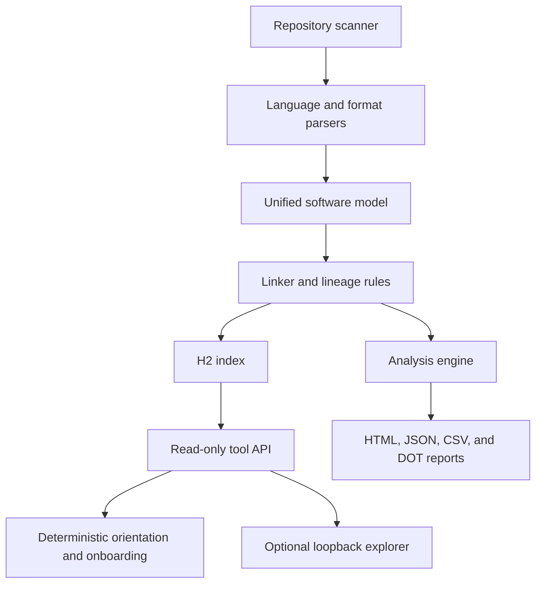

# Security Architecture

## Architectural summary

Code Atlas is a local Java command-line application. A scan discovers files,
hashes accepted inputs, selects parsers through Java `ServiceLoader`, merges facts
into a language-neutral model, resolves relationships, persists a completed scan,
runs deterministic analysis, and writes reports. The application does not compile
or execute the analyzed source.

## Component controls

### Scanner

- Reads regular files under the selected root.
- Excludes common build, dependency, version-control, and tool-output directories.
- Does not follow symbolic links unless explicitly enabled.
- Skips files above the per-file limit.
- Fails when file-count, accepted-byte, or elapsed-time limits are exceeded.
- Uses SHA-256 content hashes for change detection and scan identity.

### Parsers and model

- Treat file content as data and do not invoke compilers or repository scripts.
- Expose facts through typed entities, relationships, locations, attributes, and
  diagnostics.
- Preserve unresolved and ambiguous references rather than selecting a target
  without evidence.
- Use deterministic ordering where concurrent work could affect output.

### Persistence

- Uses an embedded H2 database stored at an operator-selected location.
- Writes scan state transactionally and exposes only the latest completed scan to
  read-only consumers.
- Opens agent and tool sessions with database-level read-only access.
- Associates results with a content-derived scan identifier.

### Reports and onboarding output

- Are written outside the analyzed repository by default.
- Contain source-derived metadata, locations, hashes, relationships, and findings.
- Are self-contained for offline use.
- Must be protected and retained according to the source repository's controls.

### Optional explorer

- Binds only to the operating system loopback address.
- Accepts only `GET` requests and checks the `Host` header against loopback names.
- Serves generated views, never arbitrary files.
- Escapes untrusted model text and uses a restrictive Content Security Policy.
- Has no authentication because it is a local single-user convenience view, not a
  multi-user service. Local processes may still reach it.
- Is unavailable in hardened mode.

## Privilege model

The process runs with the invoking user's permissions and needs no elevated
privilege. Give the account read-only access to the repository when feasible and
write access only to dedicated index, report, and temporary directories. Do not
run Code Atlas as an administrative or shared service account.

## Network model

Core operation makes no network request. Maven requires dependency access only in
the build environment. The optional explorer opens a local loopback listener but
does not load external browser assets. Hardened mode prevents listener startup.

## Cryptography

- SHA-256 hashes identify source content and release artifacts.
- Build provenance and detached signatures authenticate release origin when the
  applicable workflow or maintainer key is used.
- Code Atlas does not encrypt its index or reports. Use operating-system or volume
  encryption where confidentiality at rest is required.

## Security assumptions

- The Java 21 runtime and operating system are trusted and maintained.
- The release archive is verified before installation.
- The invoking user is authorized to read the repository.
- Output directories are protected from unauthorized modification and disclosure.
- Reviewers account for stated static-analysis blind spots.
