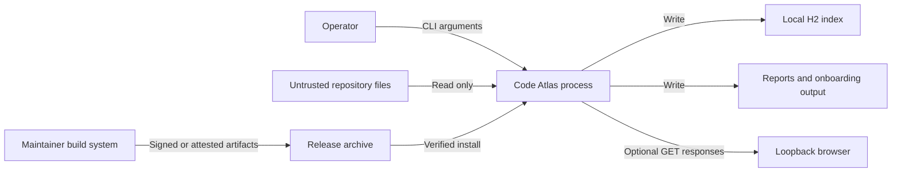

# Threat Model

## Scope and method

This model covers the Code Atlas command-line application, its parsers, local H2
index, generated reports, optional loopback explorer, build pipeline, and release
artifacts. It uses a data-flow and misuse-case review informed by common STRIDE
categories. Revisit it when a parser, network interface, persistence format,
privilege requirement, or release process changes.

## Security objectives

1. Do not modify the repository being analyzed.
2. Do not send repository content or index content over a network.
3. Prevent untrusted repository content from causing code execution or escaping
   the selected output locations.
4. Preserve honest evidence, provenance, uncertainty, and scan identity.
5. Protect release integrity and make third-party components reviewable.
6. Bound resource consumption when analyzing hostile or unexpectedly large input.

## Assets

- Source code and configuration in the analyzed repository
- Architecture, dependency, data-lineage, and vulnerability-relevant findings
- The persistent H2 index and generated reports
- Maintainer signing keys and release credentials
- Build workflow and release artifacts
- Reviewer trust in scan identifiers, hashes, evidence, and limitations

## Trust boundaries

Repository files are untrusted parser input even when they come from an internal
source-control system. The index and reports may reveal sensitive architecture
facts and should inherit the repository's handling controls.

## Threats and controls

| ID | Threat | Existing controls | Residual risk and review action |
|---|---|---|---|
| TM-01 | Crafted source triggers parser crash or excessive work | File-size, file-count, total-byte, duration, and worker limits; parser robustness tests; no source execution | Parser complexity varies. Use hardened limits and isolate scans of untrusted repositories. |
| TM-02 | Symbolic links expose files outside the repository | Links are not followed by default | Enabling link following expands scope. Review repository links before using that option. |
| TM-03 | Repository content causes output path traversal | Reports use application-selected output roots; parsers emit model facts, not repository paths to write | New exporters must preserve root confinement and receive security review. |
| TM-04 | Generated HTML executes repository-supplied script | Model text is HTML-escaped; explorer uses a restrictive CSP with per-response nonce | Browser defects and future rendering changes remain possible. Keep tests and browser updates current. |
| TM-05 | Local web interface is reached through host-header or browser routing tricks | Loopback bind, GET-only routing, Host allowlist, no file serving, read-only index | Other local users or processes may access the port. Hardened mode disables the listener. |
| TM-06 | Index or reports expose source-derived architecture | Local-only processing and operator-selected output locations | File permissions, backup, endpoint protection, and deletion are deployment responsibilities. |
| TM-07 | A failed scan replaces trusted evidence | Only completed scans are exposed; failed scans are marked and the previous completed scan remains available | Storage corruption or privileged local modification can still affect evidence. Protect the index directory. |
| TM-08 | Results overstate completeness | Coverage, unresolved references, ambiguity, truncation, inference, confidence, and limitations are explicit | Static analysis cannot prove all runtime paths. Require targeted review or runtime evidence for critical flows. |
| TM-09 | Compromised dependency or build changes release behavior | Locked dependency versions, SBOM, static analysis, secret scanning, dependency review, checksums, provenance workflow, optional detached signatures | Build services and maintainer credentials remain trust anchors. Protect them and review workflow changes. |
| TM-10 | Artifact substitution after publication | SHA-256 checksums, release manifest, provenance attestation, optional GPG signatures | A checksum from the same compromised channel is insufficient by itself. Verify an independent signature or attestation identity. |
| TM-11 | Malicious arguments or paths target unintended local data | Explicit repository, index, and output paths; no administrative privileges required | The process has the rights of the invoking user. Run under a least-privilege account and validate automation inputs. |
| TM-12 | Sensitive values appear in logs or reports | Logs focus on paths, counts, diagnostics, stable identifiers, and evidence locations rather than full source text | Names, paths, SQL identifiers, and configuration keys can still be sensitive. Handle output like source metadata. |

## Abuse cases

- A user scans a directory broader than intended and creates an index of unrelated
  source. Mitigation: use an explicit canonical repository path and dedicated
  output directory; inspect the command before unattended execution.
- A repository contains a very large number of tiny files. Mitigation: scan file
  and duration caps fail the operation instead of silently presenting a partial
  result as complete.
- A crafted entity name attempts HTML or query-string injection. Mitigation:
  contextual escaping, strict routes, safe redirects, CSP, and regression tests.
- A release archive is replaced with a modified file. Mitigation: compare the
  archive to the manifest and verify its signature or build provenance.

## Out of scope

- Compromise of the operating system, Java runtime, or a privileged local account
- Confidentiality after an authorized user exports or shares a report
- Dynamic behavior that is absent from source or hidden behind unsupported
  reflection, generated code, native code, encrypted content, or remote services
- Security of third-party repository hosting and build services beyond the
  repository's pinned workflow and provenance controls

## Review triggers

Update this model for every new listener or protocol, parser technology, source
execution feature, external service, credential use, persistence engine, or
privilege change. Also review it after a security incident or a material parser
denial-of-service finding.
